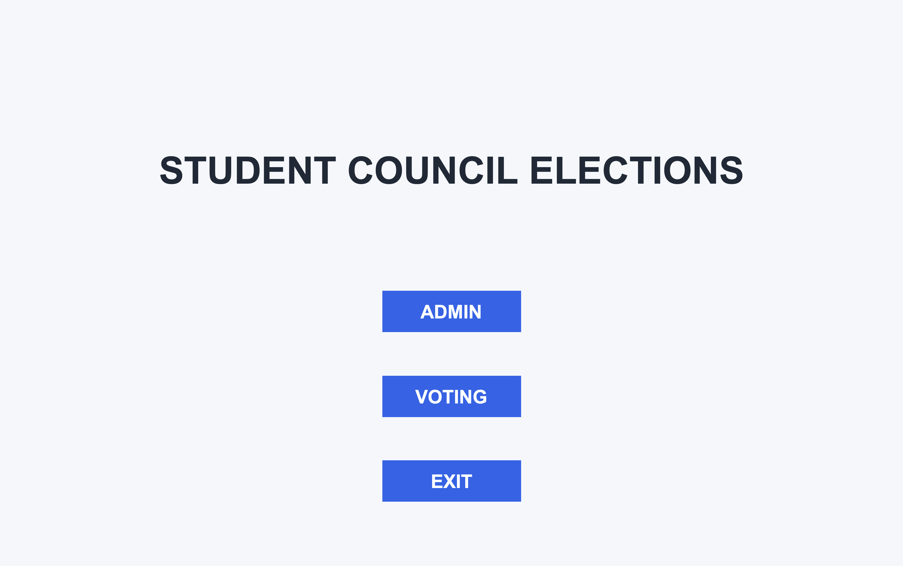
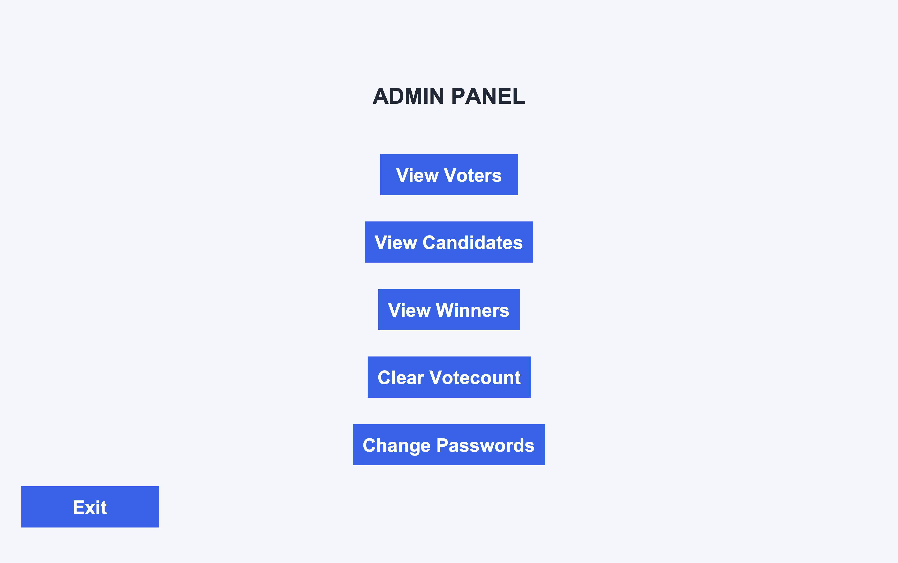
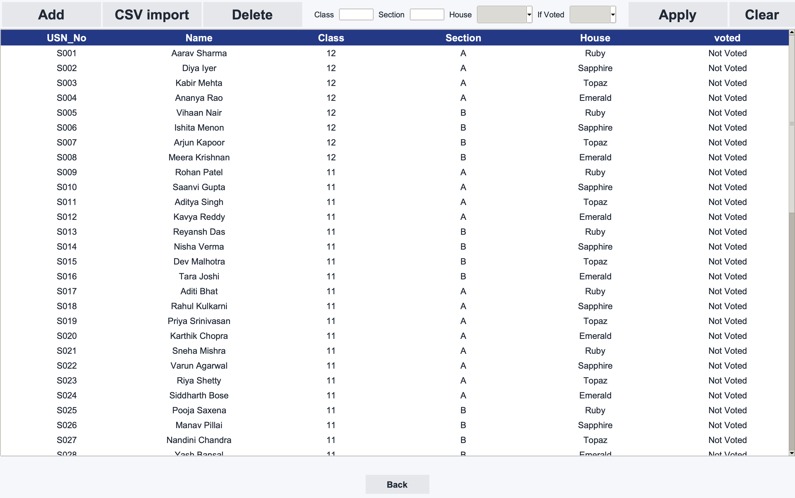
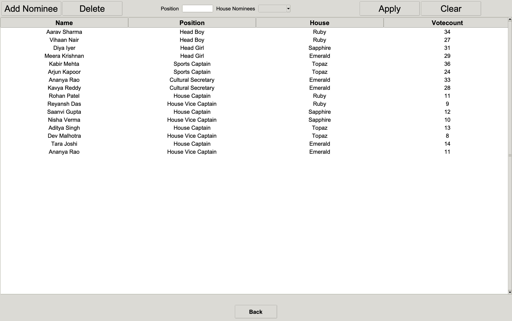
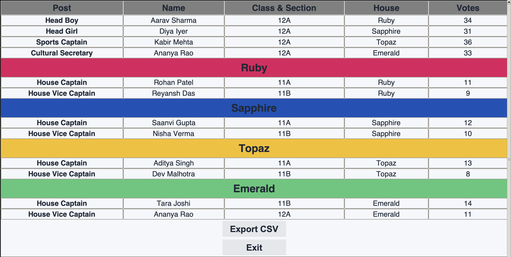
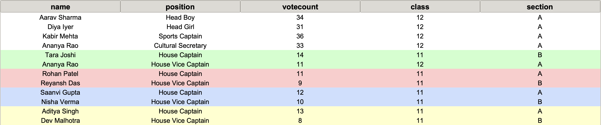

# Student Council Election Management System

A desktop-based School Voting System developed using Python and Tkinter as a Class 12 Computer Science project.

This project is designed to help school management conduct Student Council Elections in an easier, faster, and more secure way. It provides a complete election workflow for both administrators and students.

Students can select their class, section, and name, view their house, and vote for their preferred candidates for school-level and house-level positions. The system prevents a student from voting more than once by maintaining their voting status.

Administrators can manage voter and candidate records by adding, editing, deleting, filtering, and importing student details through CSV files. They can also clear vote counts, change the admin and exit passwords, view election winners in table or printable formats, and export winner details to a CSV file.

The application uses Python with Tkinter and ttk for the graphical interface, SQLite for local data storage, and CSV files for importing voter data and exporting results. Passwords are stored as hashes in `passwords.txt` rather than as readable plain text.

## Features

- Admin login and password management
- Add, edit, delete, and filter voter records
- Add, edit, delete, and filter nominee records
- Import voter details from a CSV file
- Class, section, name, and house-based voting flow
- Prevents students from voting more than once
- Supports school-level and house-level positions
- Displays winners in table format
- Displays winners in a printable format
- Exports winner details to a CSV file
- Uses a local SQLite database

## Technologies Used

- Python
- Tkinter and ttk
- SQLite
- CSV module

## Project Structure

```text
School-Voting-System/
├── main.py
├── passwords.txt
├── sample_voters_large.csv
├── screenshots/
│   ├── main-menu.png
│   ├── admin-panel.png
│   ├── winners-printable.png
│   └── winners-table.png
│   └── voters-view.png
│   └── candidates-view.png
└── README.md
```

## Requirements

- Python 3.10 or later
- Tkinter, included with most Python installations

## How to Run

1. Download or clone this repository.
2. Open Terminal in the project folder.
3. Run:

```bash
python main.py
```

The SQLite database is created automatically when the application is run.

## Default Passwords

The project includes default passwords so it can be tested immediately.

| Access | Default Password |
| --- | --- |
| Admin Panel | `ADMIN` |
| Exit Voting Mode | `EXIT` |

Passwords can be changed later from the **Change Passwords** option in the Admin Panel.

## Data Privacy

This repository does not include real student information or actual election data.

Any data used for testing or demonstration should be fictional.

## Screenshots

### Main Menu

<p align="center">
  
</p>

### Admin Panel

<p align="center">
  
</p>

### Voters View

<p align="center">
  
</p>

### Candidates View

<p align="center">
  
</p>

## Winners

<div align="center">
  <b>Printable Winners View</b><br><br>
  
</div>

<br>

<div align="center">
  <b>Table Winners View</b><br><br>
  
</div>

## Author

Created by `Gautam A` and group as a Class 12 Computer Science project.
